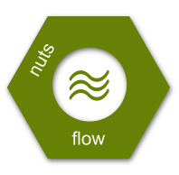

- `Introduction <https://maet3608.github.io/nuts-flow/introduction.html>`_
- `Installation <https://maet3608.github.io/nuts-flow/installation.html>`_
- `Tutorial <https://maet3608.github.io/nuts-flow/tutorial/introduction.html>`_
- `Documentation <https://maet3608.github.io/nuts-flow/>`_
- `Github <https://github.com/maet3608/nuts-flow>`_

**nuts-flow** is largely a thin wrapper around Python’s *itertools* that allows
the chaining of iterators using the ``>>`` operator. This leads to more
readable code that highlights the flow of data. The following example shows
two implementations of a simple data processing pipeline; the first based on
*itertools* and the second using **nuts-flow**:

  >>> from itertools import islice, ifilter
  >>> list(islice(ifilter(lambda x: x > 5, xrange(10)), 3))
  [6, 7, 8]

  >>> from nutsflow import Range, Filter, Take, Collect, _
  >>> Range(10) >> Filter(_ > 5) >> Take(3) >> Collect()
  [6, 7, 8]

Both examples extract the first three numbers within range [0, 9]
that are greater than five. However, the **nuts-flow** pipeline
is easier to understand than the nested *itertools* code.

**nuts-flow** is the base for `nuts-ml <https://github.com/maet3608/nuts-ml>`_, 
which is described `here <https://maet3608.github.io/nuts-ml/>`_ .

.. image:: https://badge.fury.io/py/nutsflow.svg
   :target: https://badge.fury.io/py/nutsflow

.. image:: https://img.shields.io/pypi/pyversions/nutsflow.svg
   :target: https://pypi.python.org/pypi/nutsflow/

.. image:: https://travis-ci.org/maet3608/nuts-flow.svg?branch=master
   :target: https://travis-ci.org/maet3608/nuts-flow

.. image:: https://coveralls.io/repos/github/maet3608/nuts-flow/badge.svg?branch=master
   :target: https://coveralls.io/github/maet3608/nuts-flow?branch=master

.. image:: https://img.shields.io/github/issues/maet3608/nuts-flow.svg
   :target: https://github.com/maet3608/nuts-flow/issues

.. image:: https://img.shields.io/badge/license-Apache%202-blue.svg
   :target: https://github.com/maet3608/nuts-ml/blob/master/LICENSE

.. image:: https://img.shields.io/github/downloads/maet3608/nuts-flow/total.svg
   :target: https://github.com/maet3608/nuts-flow

